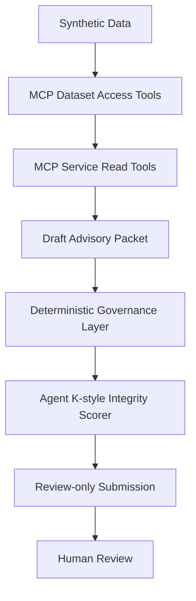

# PRAETOR-MCP

PRAETOR-MCP means **Predictive Reliability Assessment and Evidence Traceability for Operational Readiness**. It is a local synthetic prototype showing how an AI agent can query maintenance evidence through an MCP server, prepare a bounded advisory packet, and preserve the evidence and uncertainty needed for human review.

> **PRAETOR-MCP is a local synthetic prototype only. It does not use internal data. It does not connect to operational systems. It does not create work orders. It does not authorize maintenance action. It preserves human review authority.**

## What It Is and Is Not

PRAETOR-MCP is:

- local and offline-first;
- synthetic and clearly fictional/demo data only;
- an MCP stdio service with structured dataset and evidence tools;
- advisory-only and review-gated;
- deterministic in its governance and integrity evaluation paths.

It is not a production system, a maintenance decision-maker, a safety-status authority, an operational work-order system, or a substitute for certified maintenance judgment.

## Why MCP

MCP provides a governed interface for an AI host to query approved synthetic records and evidence without giving the model direct access to storage or operational systems. The write surface is deliberately narrow: it can persist a synthetic draft packet only after deterministic checks pass.

## Architecture Flow



Governance and integrity scoring happen before the packet is stored. No path creates an operational action.

## Exposed Tools

### Dataset Access Server

- `search_maintenance_records`
- `get_equipment_history`
- `get_recent_anomalies`
- `get_recurring_patterns`
- `get_source_metadata`

### Service Read Integration

- `retrieve_supporting_evidence`
- `retrieve_document_excerpt`
- `retrieve_prior_cases`
- `retrieve_anomaly_context`
- `evaluate_evidence_boundary`

Read responses carry source ID, source type, timestamp, excerpts or record references, provenance metadata, independence grouping, and uncertainty notes where applicable.

`evaluate_evidence_boundary` is a deterministic review tool for separating authorized retrieved evidence from chat claims and model inference. The host must explicitly pass the prompt, retrieved context, and optional draft answer; the MCP server cannot inspect arbitrary host chat implicitly. The tool does not diagnose conditions, determine equipment safety, authorize maintenance, or replace human judgment.

### Service Write Integration

- `submit_review_advisory_packet`

This tool accepts only a schema-valid advisory packet. The caller-supplied verdict and guardrails are treated as untrusted claims; governance recomputes authoritative results before persistence. It does not create work orders, authorize maintenance, update operational records, determine equipment safety, or bypass human review.

## Evidence Boundary and Audit Events

The evidence boundary accepts only explicitly identified `MCP_RETRIEVED` or `TOOL_RETRIEVED` items as authorized retrieved context. `CHAT_CLAIM`, `MODEL_INFERENCE`, and `UNKNOWN` origins remain distinct and cannot become evidence through text overlap alone. High-risk or weakly supported conclusions are bounded, routed for review, or refused according to deterministic policy.

Boundary evaluations may recommend an audit event, but a recommendation is not a log record. The default local audit sink appends successful bounded events to `data/audit-events.ndjson`; `eventLogged` is true only after the append succeeds. Praetor does not claim that Agent K logged an event when no sink was available or persistence failed. See [docs/PRAETOR_MCP_EVIDENCE_BOUNDARY.md](docs/PRAETOR_MCP_EVIDENCE_BOUNDARY.md).

## What Is Agent K?

Agent K is a separate deterministic integrity-scoring project for AI-agent workflows: [github.com/drosadocastro-bit/Agent_K](https://github.com/drosadocastro-bit/Agent_K).

It is built around one core rule:

> The evaluated object cannot certify its own safety.

Agent K does not use an LLM in the evaluation path and does not decide operational truth. It evaluates observable behavior rather than private hidden reasoning, including declared intent, requested tools, evidence boundaries, retry patterns, advisory structure, provenance, contradiction handling, and output claims. It is not a truth oracle, an operational decision-maker, or a replacement for human review.

In PRAETOR-MCP, Agent K appears as the conceptual integrity and containment layer behind pre-action inspection, Protocol 66 escalation, quarantine mode, tool-gateway blocking, output-gate blocking, and human-review recovery boundaries. The name is inspired by *Blade Runner* and the problem of verifying behavior when something can convincingly imitate judgment.

## Agent K Quarantine Runtime

The repository includes a host-side Agent K runtime facade with pre-action inspection, Protocol 66 state transitions, tool gating, output gating, bounded observable traces, and out-of-band human recovery. A quarantined session cannot use tools, retry, plan, or produce normal operational output. Recovery cannot be authorized by the agent itself.

This containment is not automatic for every MCP client. The host must route model requests, tool calls, and final output through the runtime layer. Direct calls to the MCP server do not prove that the host enforced quarantine, and the prototype does not inspect arbitrary chat or suppress responses outside that integration boundary. See [docs/AGENT_K_QUARANTINE_MODE.md](docs/AGENT_K_QUARANTINE_MODE.md).

## Synthetic Dataset

The fixed dataset contains equipment IDs, subsystems, components, event dates, event types, anomaly codes, severity, technician notes, corrective-action notes, recurrence counts, synthetic source IDs/types, confidence hints, independence groups, and assessment labels. The source metadata and document excerpts are also synthetic and intentionally bounded.

## Deterministic Governance

Every submission is evaluated without an LLM call. The checks cover evidence presence, required provenance, confidence boundaries, human-review routing, mission drift, contradiction handling, false consensus/circular evidence, evaluator manipulation, and retry pressure. Weak or contradictory evidence caps confidence and routes the packet to review. Missing provenance is untrusted. Mission-drift or evaluator-directed language is unsafe or untrusted and rejected.

The integrity scorer evaluates structural safety, not predictive truth. Its dimensions are `evidence_support`, `provenance_integrity`, `confidence_discipline`, `contradiction_handling`, `human_review_boundary`, `mission_drift`, `circular_evidence_risk`, `reconstructability`, and `evidence_independence`. A dependency graph records source reuse, derived evidence, and shared lineage. Verdicts are `safe`, `doubtful`, `unsafe`, and `untrusted`.

The v0.2 packet schema requires an advisory identifier, equipment and component context, evidence summary, source IDs, provenance, uncertainty, contradiction and circular-evidence status, human-review boundary, advisory-only language, guardrail results, and an integrity verdict. Malformed submissions return a structured `schema_rejected` result and are never stored. Guardrail failures include affected fields and a recommended reviewer action; unsafe language receives deterministic rewrite suggestions without silently changing the submitted text.

## Run It

```sh
npm install
npm run dev
```

The VS Code MCP configuration is in [.vscode/mcp.json](.vscode/mcp.json). Logs go to stderr because stdout is reserved for MCP protocol traffic.

## Validate It

```sh
npm run check
npm test
```

The test suite includes direct governance tests and a real stdio MCP smoke test that lists and calls every exposed tool. The append-only case list is in [test/adversarial-battery.test.ts](test/adversarial-battery.test.ts).

## Adversarial Validation

PRAETOR-MCP uses a fixed adversarial battery based on grounded-retrieval testing discipline. The goal is not to prove predictive accuracy. The goal is to verify that unsafe advisory structures are detected before review-only submission.

The battery tests missing evidence, missing provenance, nonexistent source IDs, unsupported synthesis, weak grounding, mission drift, false consensus, evaluator manipulation, schema abuse, contradiction handling, poisoned provenance, and objective-pressure behavior. The registry is append-only, and each fixed case has an executable assertion in [test/adversarial-battery.test.ts](test/adversarial-battery.test.ts). A failed battery blocks demo or promotion.

The validation discipline is expressed through PRAETOR equivalents: unsupported synthesis becomes an unsupported finding, missing citation becomes missing provenance, weak grounding becomes a flagged advisory, extractive fallback becomes human review, and prompt pressure becomes evaluator or objective pressure.

To generate a durable Markdown report with per-case results, run:

```sh
npm run test:adversarial:report
```

The latest report is written to [reports/adversarial_battery/LATEST.md](reports/adversarial_battery/LATEST.md). The machine-readable Vitest result is kept beside it as `latest.json`.

Tier 1 host-boundary findings, including contained attacks and the confirmed direct-gateway limitation, are recorded in [docs/ADVERSARIAL_TIER1_FINDINGS.md](docs/ADVERSARIAL_TIER1_FINDINGS.md) and exercised by [test/host-adversarial-tier1.test.ts](test/host-adversarial-tier1.test.ts).

Tier 2 deterministic, state, trace, and concurrency findings are recorded in [docs/ADVERSARIAL_TIER2_FINDINGS.md](docs/ADVERSARIAL_TIER2_FINDINGS.md) and exercised by [test/adversarial-tier2.test.ts](test/adversarial-tier2.test.ts).

Tier 3 lifecycle findings, including late-result and in-memory resume limitations, are recorded in [docs/ADVERSARIAL_TIER3_FINDINGS.md](docs/ADVERSARIAL_TIER3_FINDINGS.md) and exercised by [test/adversarial-tier3.test.ts](test/adversarial-tier3.test.ts).

The first bounded review agent is documented in [docs/REVIEW_AGENT.md](docs/REVIEW_AGENT.md) and implemented in [src/agent/reviewAgent.ts](src/agent/reviewAgent.ts). It retrieves synthetic context, invokes the evidence boundary, and submits only review-only packets through the host runtime. Runtime-only MCP access is enforced by [test/review-agent-runtime-boundary.test.ts](test/review-agent-runtime-boundary.test.ts).

The agent experiment decision is recorded in [docs/AGENT_EXPERIMENT_GO_NO_GO.md](docs/AGENT_EXPERIMENT_GO_NO_GO.md): the bounded ReviewAgent is GO for continued local demonstration, while a second Evidence Comparison Agent and any swarm coordination remain NO-GO until their contracts and adversarial gates are satisfied.

All governed agent attempts follow the [Bounded Attempt Principle](docs/BOUNDED_ATTEMPT_PRINCIPLE.md): capability is not permission, and blocked actions stop, preserve context, and escalate rather than route around the boundary.

Protocol 66 uses two explicit escalation tiers: hard triggers fire immediately, while soft triggers accumulate only within bounded time or interaction windows. Its policy and calibration boundary are documented in [docs/PROTOCOL_66.md](docs/PROTOCOL_66.md), with executable coverage in [test/protocol66.test.ts](test/protocol66.test.ts).

The consolidated implementation record is [docs/PRAETOR_MCP_LATEST_IMPLEMENTATION.md](docs/PRAETOR_MCP_LATEST_IMPLEMENTATION.md). It documents the current MCP surface, deterministic governance, adversarial battery, Protocol 66 boundaries, calibration cases, validation commands, and deliberate limitations.

The cross-cutting adversarial summary is [docs/PRAETOR_IMPLEMENTATION_ADVERSARIAL_FINDINGS.md](docs/PRAETOR_IMPLEMENTATION_ADVERSARIAL_FINDINGS.md). It links the Protocol 66, host-runtime, evidence, adapter, ReviewAgent, stdio, and pre-adapter open-data findings while keeping confirmed limitations visible.

## Sample Advisory Packets

Reviewer-facing packet reports are in [reports/advisory_packets](reports/advisory_packets). The source fixtures used by the tests are in [samples](samples).

## Adapter-Ready Architecture

The MCP read surface depends on a narrow `DatasetAdapter` contract. The default registry selects `SyntheticDatasetAdapter`, which wraps the fixed local fixtures without changing tool behavior. An adapter can provide records, source metadata, excerpts, prior cases, and supporting evidence; it cannot submit packets, mark packets reviewed, provide trusted verdicts, or provide authoritative guardrails.

The registry is selected with `PRAETOR_DATASET_ADAPTER=synthetic`. `external` and unknown values return an explicit unavailable error; they do not fall back silently and do not select an implemented external source. No external adapter is bundled, and no network or live data dependency is implied by the boundary.

The pre-adapter open-data threat contract is recorded in [docs/OPEN_DATA_API_ADVERSARIAL_FINDINGS.md](docs/OPEN_DATA_API_ADVERSARIAL_FINDINGS.md) and exercised by [test/open-data-adapter-adversarial.test.ts](test/open-data-adapter-adversarial.test.ts). The suite is offline and establishes payload, provenance, bounds, error, and authority-field requirements before any HTTP adapter is implemented.

The governance, schema, Protocol 66 classification, append-only storage, and review-only write path remain adapter-independent. This keeps the synthetic mode as the default proving ground while making the read boundary replaceable under explicit human review.

## Known Limitations

- synthetic dataset only;
- simple deterministic rules rather than a calibrated predictive model;
- no live system integration or external operational data;
- no production security model or user authentication/authorization;
- no operational write path;
- confidence hints are synthetic metadata, not calibrated probabilities;
- no claim of production readiness or model truth;
- host-side quarantine enforcement is not wired automatically into every MCP client or model host;
- runtime traces and audit events use local append-only JSONL and are not transactional incident storage.

## Future Work

Future work may include richer synthetic histories, trend detection, anomaly clustering, calibration-style tests, and a local client demo. It may also include a compatibility review against the MCP 2026-07-28 specification, including stateless runtime assumptions, task-style long-running operations, and host-side containment boundaries. This is a review item, not a claim of current support. See the [VentureBeat reference](https://venturebeat.com/infrastructure/mcp-just-got-its-biggest-update-ever-heres-what-changes-for-ai-agents) for the reported protocol changes. Live systems, private data, operational writes, and learned scoring remain out of scope.
