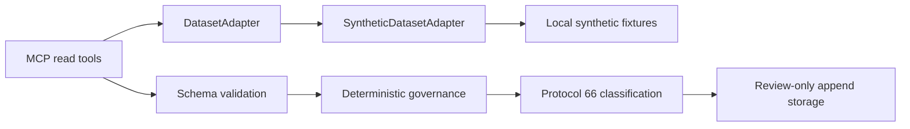

# PRAETOR-MCP Non-Monolithic Architecture

## Purpose

This document records the adapter-ready boundary for the local synthetic prototype. Synthetic mode remains the default and the only bundled dataset implementation. The boundary is designed for deterministic testing and future replacement of read-side data access without granting an adapter governance authority.

## Boundaries

The `DatasetAdapter` contract is intentionally limited to retrieval:

- maintenance record search and lookup;
- source metadata lookup;
- recent anomaly and recurring-pattern reads;
- supporting evidence, document excerpt, and prior-case reads.

The contract does not include packet submission, persistence, review state, verdicts, guardrails, confidence authorization, or equipment status. Those concerns remain in the MCP service, schema, governance, integrity, Protocol 66, and storage modules.

## Registry Behavior

`getActiveDatasetAdapter()` reads `PRAETOR_DATASET_ADAPTER` and defaults to `synthetic`. The bundled synthetic adapter is returned for the explicit `synthetic` value. `external` and unknown values raise an explicit unavailable error rather than selecting an unimplemented or untrusted source. This preserves MCP stdout for protocol traffic.

There is no external adapter in this prototype. Adding one would require a separate implementation, explicit tests, provenance handling, and human review of its operational boundary. The current code does not make network calls or require credentials.

## Compatibility Strategy

Existing synchronous helper exports remain in `src/tools.ts` for local callers and regression tests. MCP handlers use the adapter asynchronously. This keeps the current public helper behavior stable while ensuring the actual MCP read path is replaceable.

The write path remains in `src/tools.ts`. It validates the strict packet schema, recomputes integrity and guardrail results, derives contradiction and circular-evidence status, analyzes evidence independence, and appends only accepted review-only packets. Adapter-returned metadata is evidence input, not authoritative governance output.

## Verification Boundary

`test/adapter-boundary.test.ts` verifies that:

- the synthetic implementation satisfies the retrieval contract;
- supplied adapters control MCP read results;
- adapter objects have no submission, review, verdict, or guardrail authority;
- schema validation and governance remain outside the adapter;
- Protocol 66 classification remains independent of adapter selection;
- unknown adapter configuration does not select an unvalidated mode.

This architecture is a refactor boundary, not a claim that an external data source is safe, available, or implemented.